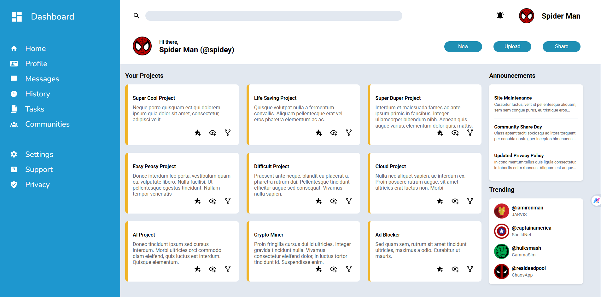

# Admin-Dashboard

🔴 **Live Demo:** https://rugved1218.github.io/Admin-Dashboard/  
💻 **Source Code:** https://github.com/rugved1218/Admin-Dashboard  

---

## Preview



---

## About The Project

This project is a modern **Admin Dashboard UI** built using advanced **CSS Grid and Flexbox** layout techniques. It replicates a real-world dashboard interface with proper visual hierarchy, structured layout, and clean design.

The goal of this project was to develop strong frontend layout skills and understand how professional dashboards are structured.

---

## Key Skills Demonstrated

- Advanced CSS Grid layout implementation  
- Flexbox for component alignment  
- Professional dashboard UI structuring  
- Layout planning and visual hierarchy  
- Clean and maintainable CSS architecture  
- Real-world frontend project structuring  

---

## Tech Stack

- HTML5  
- CSS3  
- CSS Grid  
- Flexbox  

---

## Features

- Structured sidebar navigation  
- Header with search and user profile  
- Project cards section  
- Announcements panel  
- Trending section  
- Clean, modern UI layout  
- Scalable and maintainable structure  

---

## Why This Project Matters

Admin dashboards are widely used in real-world applications such as:

- SaaS platforms  
- Analytics tools  
- Company internal systems  
- Management systems  

This project demonstrates the ability to build structured and scalable UI layouts similar to those used in production environments.

---

## Project Structure

```
Admin-Dashboard/
│
├── index.html
├── style.css
├── assets/
│
└── README.md
```


---

## What I Learned

- How to design complex layouts using CSS Grid  
- When to use Grid vs Flexbox  
- How professional dashboards are structured  
- Improving UI alignment and spacing  
- Writing cleaner and more organized CSS  

---

## Future Improvements

- Add full responsive support for mobile and tablet  
- Add animations and transitions  
- Add JavaScript interactivity  
- Convert to React-based dashboard  
- Connect with backend  

---

## Author

**Rugved Bajare**

GitHub: https://github.com/rugved1218  

---

## Acknowledgements

Built as part of The Odin Project curriculum to strengthen frontend layout and UI development skills.